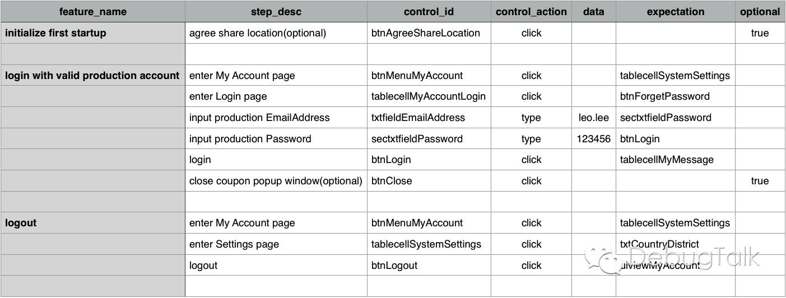

## AppiumBooster

AppiumBooster helps you to write automation testcases in yaml format or csv tables, without writing a snippet of code.

## write testcases in yaml (recommended)

Take DebugTalk+ Discover's login and logout function as an example.


In order to test these functions above, you can write testcases in yaml format like this.

```yaml
# ios/testcases/login_and_logout.yml
---
Login and Logout:
  - SettingsFeatures | initialize first startup
  - AccountFeatures | login with valid test account
  - AccountFeatures | logout
```

In the testcases, each step is combined with two parts, joined by a separator `|`. The former part indicates essential features defined in `ios/features/` directory, and the latter part indicates feature name, which is defined in feature yaml files like below.

```yaml
# ios/features/Settings.yml
---
SettingsFeatures:
  initialize first startup:
    - SettingsSteps | agree share location(optional)

# ios/features/Account.yml
---
AccountFeatures:
  login with valid test account:
    - AccountSteps | enter My Account page
    - AccountSteps | enter Login page
    - AccountSteps | input test EmailAddress
    - AccountSteps | input test Password
    - AccountSteps | login
    - AccountSteps | close coupon popup window(optional)

  logout:
    - AccountSteps | enter My Account page
    - SettingsSteps | enter Settings page
    - AccountSteps | logout
```

Likewise, each step of essential features is combined with two parts, joined by a separator `|`. The former part indicates step file located in `ios/steps/` directory, and the latter part indicates feature step name, which is defined in steps yaml files like below.

```yaml
# ios/steps/AccountSteps.yml
---
AccountSteps:
  enter My Account page:
    control_id: btnMenuMyAccount
    control_action: click
    expectation: tablecellMyAccountSystemSettings

  enter Login page:
    control_id: tablecellMyAccountLogin
    control_action: click
    expectation: btnForgetPassword

  input test EmailAddress:
    control_id: txtfieldEmailAddress
    control_action: type
    data: ${config.TestEnvAccount.UserName}
    expectation: sectxtfieldPassword

  input test Password:
    control_id: sectxtfieldPassword
    control_action: type
    data: ${config.TestEnvAccount.Password}
    expectation: btnLogin

  login:
    control_id: btnLogin
    control_action: click
    expectation: tablecellMyMessage
```

## write testcases in tables

You can also write testcases in any table tools, including MS Excel and iWork Numbers, and even in plain CSV format.

In order to test the same functions above, you can write testcases in tables like this.



After the testcases are finished, export to CSV format, and put the csv files under `ios/testcases/` directory.

## start

Once the testcases are done, you are ready to run automation test on your app.

Run the automation testcases is very easy. You can execute `ruby start.rb -h` in the project root directory to see the usage.

```
$ ruby start.rb -h
Usage: start.rb [options]
    -p, --app_path <value>           Specify app path
    -t, --app_type <value>           Specify app type, ios or android
    -f, --testcase_file <value>      Specify testcase file(s)
    -d, --output_folder <value>      Specify output folder
    -c, --convert_type <value>       Specify testcase converter, yaml2csv or csv2yaml
        --disable_output_color       Disable output color
```

And here are some examples.

```bash
$ cd ${AppiumBooster}
# execute specified testcase with absolute testcase file path
$ ruby run.rb -p "ios/app/test.zip" -f "/Users/Leo/MyProjects/AppiumBooster/ios/testcases/login.yml"

# execute specified testcase with relative testcase file path
$ ruby run.rb -p "ios/app/test.zip" -f "ios/testcases/login.yml"

# execute all yaml format testcases
$ ruby run.rb -p "ios/app/test.zip" -f "ios/testcases/*.yml"

# execute all csv format testcases located in ios folder
$ ruby run.rb -p "ios/app/test.zip" -t "ios" -f "*.csv"

# convert yaml format testcase to csv format testcase
$ ruby start.rb -c "yaml2csv" -f ios/testcases/login_and_logout.yml
```

## Read more ...

[《打造心目中理想的自动化测试框架（AppiumBooster）》](http://debugtalk.com/post/build-ideal-app-automation-test-framework/)
